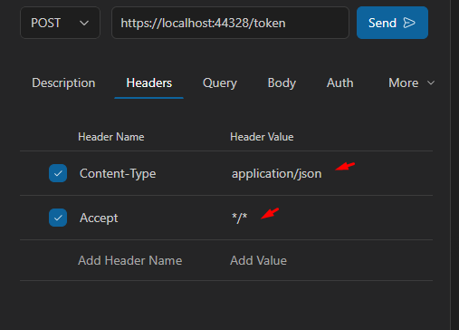
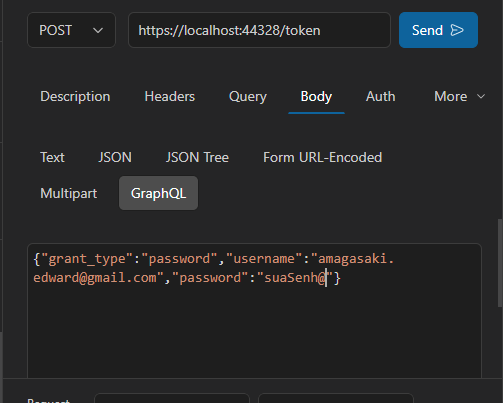
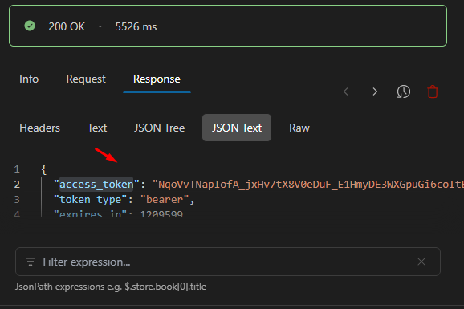
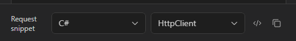
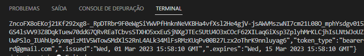

# Testando o recebimento do Token JWT externo através de um "Request" via ext. VSCode RapidAPI e C# .NET CORE HttpClient.

Para a Api externa, estamos utilizando uma WebApi 2 C# ASP.NET 4.8. com o .NET IdentityFramework / OWIN.

Tela com o resultado do nosso teste com a extensão RapidAPI do VSCode:







Através do RapidAPI, e nosso primeiro teste obtendo o token JWT de acesso, podemos utilizar uma sujestão para o código desejado. Neste caso, estaremos utilizando a biblioteca .NET HttpClient.

```
using System.Net.Http;
using System.Net.Http.Headers;

var client = new HttpClient();
var request = new HttpRequestMessage
{
    Method = HttpMethod.Post,
    RequestUri = new Uri("https://localhost:44328/token"),
    Headers =
    {
        { "Accept", "*/*" },
    },
    Content = new StringContent("grant_type=password&username=amagasaki.edward%40gmail.com&password=suaSenh@")
    {
        Headers =
        {
            ContentType = new MediaTypeHeaderValue("text/plain")
        }
    }
};
using (var response = await client.SendAsync(request))
{
    response.EnsureSuccessStatusCode();
    var body = await response.Content.ReadAsStringAsync();
    Console.WriteLine(body);
}
```
Após implementação no arquivo Program.cs , obtemos o mesmo resultado solicitado pelo teste anterior,através do comando: Console.WriteLine(body); obtemos o resultado conforme a imagem abaixo:


